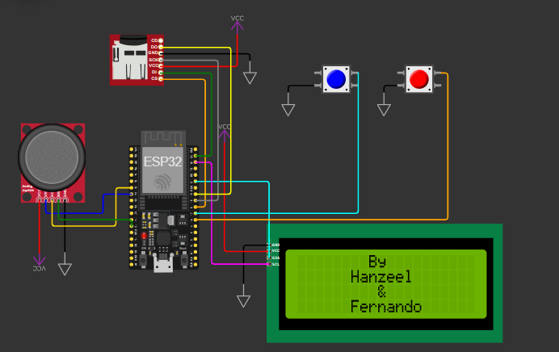

# Juego LCD 20x4

Juego creado por Fernando Villaseñor y Hanzeel Villa en la materia IoT. Empezó como una broma, 
terminó como un proyecto y se ve GOD.

Wowki  
[https://wokwi.com/projects/408307126785754113](https://wokwi.com/projects/408307126785754113)

## Componentes necesarios

* ESP32
* Cable USB a micro USB
* Pantalla LCD 20x4
* Módulo Joystick
* 2 botones
* Módulo Micro SD
* Micro SD no mayor a 32 GB
* Amplificador MAX98357A
* Bocina de 8 Ohms y 0.5 Watts
* Placa expansora para el ESP (opcional)

## Características

1. Intro con una canción de fondo mostrando el nombre del juego y los creadores.
2. Menú de selección entre jugar y ver los puntajes más altos.
3. Pausa y reinicio de partida.
4. Obstáculos en filas aleatorias.
5. Almacenamiento en la Micro SD de los puntajes más altos con su respectivo jugador.
6. Música de fondo para la intro y el gameplay.

## Cómo jugar

1. Selecciona "Play" dentro del menú haciendo clic en el joystick.
2. Esquiva los obstáculos moviéndote arriba y abajo.
3. Puedes reiniciar/volver al menú con el botón izq o poner pausa con el botón der.
4. Después de 10 obstáculos esquivados, la velocidad aumenta.
5. Si chocas con algún obstáculo, el juego acaba.
6. Si consigues uno de los **mejores 4 marcadores**, puedes registrar tu nombre para guardar tu puntuación.
7. Tienes un **máximo de 3 caracteres**. Presiona el botón del joystick para confirmar tu selección de letra, presiona el botón izq para reiniciar el nombre o el botón der para confirmar tu nombre.
8. ¡DIVIÉRTETE, NENA!

## Mejoras

1. Eliminar variables/funciones innecesarias.
2. Crear una clase para los obstáculos.
3. Usar correctamente variables públicas y privadas.
4. Hacer más intuitiva la interacción.
5. Agregar comentarios. XD
6. Solucionar el problema de la música, que a veces funciona y a veces no (tal vez con dual core).
7. Cuando se agregue la última letra del nickname, mostrar una vista previa del nombre a guardar.
8. Abierto a feedback.
